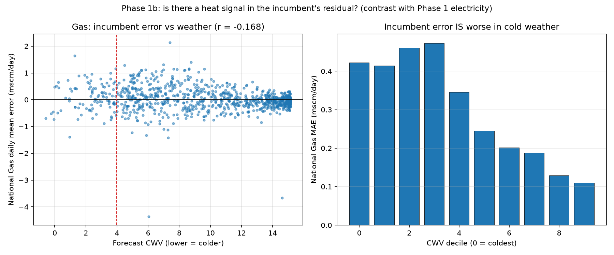
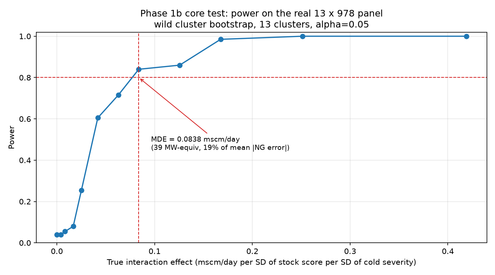

# GB heat demand nowcast

**Does a bottom-up, building-stock model of GB domestic heat demand contain
information that published operational forecasts do not already have?**

Short answer: **no**, and this repository is the evidence. It is a two-target
study — GB electricity and GB gas — with the point-in-time discipline,
pre-specified baselines, pre-computed minimum detectable effect and placebo
validation needed to make a negative result mean something.

The finding is not "the model didn't work". It is a quantified statement about
**when Energy Performance Certificate data can and cannot add value to
operational demand forecasting**, and about which constraint binds.

---

## Headline results

### Phase 1 — electricity, GB aggregate

A standard HDD-plus-calendar regression against NESO's published day-ahead
national demand forecast, 2024-02-04 → 2026-08-12, 44,206 half-hourly periods.

| Model | MAE (MW) | RMSE (MW) | Bias (MW) |
|---|---|---|---|
| **NESO day-ahead** | **686** | **927** | **+7** |
| HDD+calendar baseline | 1,650 | 2,076 | −809 |
| Seasonal naive (lag 7d) | 2,070 | 2,781 | +64 |

The baseline is **2.41× worse** than the incumbent. But decomposing that
964 MW gap shows it is **not heat-shaped**:

| Component of the gap | Share |
|---|---|
| Recoverable by a perfect temperature forecast | **5%** |
| Recoverable by removing a constant level bias | 21% |
| Attributable to embedded wind and solar | **~49%** |
| Structural remainder | ~25% |

Roughly half is embedded renewables — invisible to any building-stock model,
and already impounded by NESO. And **NESO's own error is flat across the
temperature distribution**: correlation with heating degree days r = −0.013
over 921 days, coldest-decile MAE 438 MW against 441 MW on all days.

There is no heat-shaped residual in the electricity incumbent's forecast.

### Phase 1b — gas, LDZ panel

The same exercise on the *primary* target: daily gas offtake for all 13 Local
Distribution Zones, against National Gas's published D−1 LDZ forecast,
2023-12-01 → 2026-08-06, 12,714 zone-days.

| Model | MAE (mscm/day) | RMSE | Bias |
|---|---|---|---|
| **National Gas D−1** | **0.438** | **0.948** | **+0.026** |
| CWV+calendar baseline | 0.690 | 1.193 | −0.450 |
| Seasonal naive (lag 7d) | 1.629 | 2.644 | +0.084 |

**The gas picture is materially different, and it points the other way:**

| | Electricity | Gas |
|---|---|---|
| Baseline ÷ incumbent MAE | 2.41× | **1.57×** |
| Incumbent error vs weather severity | r = −0.013 | **r = −0.168** |
| Incumbent MAE, coldest vs warmest decile | 438 vs 441 MW (flat) | **0.422 vs 0.110 (3.8×)** |
| Weather-forecast error, share of gap | 5% | **~0%** |
| Non-heat wedge (embedded renewables) | ~49% of gap | **absent by construction** |



**National Gas's published day-ahead forecast is 3.8× less accurate on the
coldest decile of days than on the warmest.** Something heat-shaped is
systematically unforecast. That is a real, reportable observation about
operational gas forecasting.

### The core test — and the kill criterion

Does **building-stock heterogeneity** explain that residual? Two-way fixed
effects on the LDZ × day panel, stock × weather-severity interaction, wild
cluster bootstrap over 13 clusters, stock features built from **17,337,624
dwellings** in the EPC register cut at 2023-11-30.

| Feature | Role | β (mscm/day) | β ÷ MDE | Wild-bootstrap p |
|---|---|---|---|---|
| **`mean_sap`** | **primary** | **+0.0242** | **0.29×** | **0.248** |
| `share_solid_wall` | secondary | +0.0371 | 0.44× | 0.019 |
| `mean_floor_area` | secondary | −0.0262 | 0.31× | 0.027 |
| `share_wall_eff_poor` | secondary | +0.0272 | 0.32× | 0.121 |
| `share_mains_gas` | secondary | +0.0177 | 0.21× | 0.327 |
| `share_pre_1930` | secondary | −0.0002 | 0.00× | 0.986 |

Nothing clears the Bonferroni threshold (0.010). **No estimate anywhere reaches
the minimum detectable effect** — the largest is 0.44×.

**Kill criterion A3 fired.** Recommendation: do not proceed to bottom-up stock
construction; write up the negative result.

Full write-ups: [`reports/phase1_findings.md`](reports/phase1_findings.md) and
[`reports/phase1b_findings.md`](reports/phase1b_findings.md).

---

## Why this null is worth reading

Most negative results are uninterpretable because you cannot tell absence from
invisibility. Three things make this one different.

### 1. The minimum detectable effect was computed *before* the estimates

Simulated on the real 13 × 979 panel — within-transformed by zone and day,
residuals resampled by whole cluster to preserve serial correlation, tested
with the same bootstrap:

| | |
|---|---|
| **MDE at 80% power** | **0.0838 mscm/day** |
| in MW-equivalent | 38.7 MW |
| as a share of mean absolute incumbent error | **19.1%** |
| simulated size at zero effect | 0.040 (nominal 0.05) |



The test can only detect a *large* interaction. That is stated up front rather
than discovered afterwards, so the null reads as "no large effect" — not as an
unbounded shrug.

### 2. A placebo ran before any real feature

200 randomised per-zone scores through the identical pipeline:

- rejection rate **0.060** at nominal 0.05
- p-values approximately uniform (median 0.54)
- **0 of 200** placebo estimates reached the MDE

The pipeline returns nothing when nothing is there.

### 3. Naive inference would have got the opposite answer

The primary feature's conventional cluster-robust **t = +2.19** — "significant
at 5%" by the usual rule. The wild cluster restricted bootstrap gives
**p = 0.248**. With 13 clusters the asymptotic standard error is badly biased
down, and this is the difference between reporting a finding and reporting a
null.

Three further diagnostics explain *why* the cross-section cannot support the
hypothesis: the six stock features carry ~2 effective dimensions (first two PCs
= 80.3%); the coefficient signs are internally inconsistent (`mean_sap` and
`share_solid_wall` should oppose, but both come out positive and correlate
+0.36 across zones); and dropping a single zone moves the largest estimate by
2×. **GB has 13 LDZs — that is the whole population, not a sample.**

---

## The pipeline

```
                    ┌──────────────────────────────────────┐
   POINT-IN-TIME    │  every feature gated on the moment   │
    DISCIPLINE      │  it became publicly knowable         │
                    └──────────────────────────────────────┘

  PHASE 1 — electricity, GB aggregate
  ────────────────────────────────────────────────────────────────────
  NESO CKAN ──── half-hourly demand outturn + published D-1 forecast
                 (gate: 08:45 UTC on D-1)                    │
  Open-Meteo ─── archived forecast temperature, fixed 1-day lead
                 (previous-runs API; archive starts 2024-02-04)
                                                             │
  ONS + Nomis ── 35,672 LSOA population-weighted centroids    │
  ScotGov ────── 7,392 Scottish Data Zone centroids           │
                     └─> 39-cell population-weighted grid ────┤
                                                              ▼
                              population-weighted HDD (base 15.5 °C)
                                                              │
                                                              ▼
                         per-settlement-period OLS baseline
                         walk-forward, expanding window, 7-day embargo
                                                              │
                                        scored against NESO ──┘

  PHASE 1b — gas, 13-zone LDZ panel
  ────────────────────────────────────────────────────────────────────
  National Gas ─ LDZ offtake actuals (D+1 and D+6 vintages)
                 LDZ D-1 demand forecast  ← gated by publication
                 Composite Weather Variable, forecast and outturn
                                                              │
                                                              ▼
                         per-LDZ CWV + calendar OLS baseline
                         walk-forward, same form as Phase 1
                                                              │
  EPC bulk ───── 23,076,423 certificates ≤ 2023-11-30         │
  (streamed)     └─> 17,741,503 dwellings (latest per address)│
  Xoserve ────── postcode → LDZ (1.38 M postcodes)            │
                     └─> per-LDZ stock features ──────────────┤
                                                              ▼
                    two-way fixed effects (LDZ + day)
                    outcome = published forecast error
                    regressor = stock × weather severity
                    wild cluster bootstrap, 13 clusters
                                                              │
                                                              ▼
                              MDE computed first · placebo first
```

### Point-in-time discipline

The rule: **no feature may use information that was not publicly available at
the moment being predicted.** Three traps were found and avoided; each is
recorded in [`reports/decision_log.md`](reports/decision_log.md).

| Trap | What would have happened |
|---|---|
| Open-Meteo's Historical Forecast API archives the *most recent* forecast per timestamp | Day-D values come from runs initialised on day D — **after** NESO published. Fixed by using the Previous Model Runs API at a fixed 1-day lead, at the cost of three years of history. |
| National Gas republishes its "day-ahead" LDZ forecast **~8× per gas day**, and the portal default returns the value generated at 00:15 on **D+1** | A near-outturn estimate scored as a day-ahead forecast. Would have inflated the incumbent's apparent skill and been invisible in the output. |
| EPC dedupe to latest-certificate-per-address | Latest-*ever* leaks the future. Dedupe is latest **as of** the cutoff. |

Realised weather appears only in labelled diagnostic and oracle runs, marked
`REALISED-WEATHER-DIAGNOSTIC` at the call site, carried in `_realised`-suffixed
columns, and hatched in every figure.

### Engineering notes

- **Provenance sidecars.** Every cached artefact in `data/raw/` has a JSON
  sidecar recording the URLs actually requested, retrieval timestamp, licence,
  vintage, publication-lag statement and a payload SHA-256 — so upstream
  restatement is detectable by re-pulling and comparing hashes.
- **The 88 GB problem.** The EPC bulk register is 7.57 GB compressed / 87.8 GB
  uncompressed, against 8.2 GiB of free disk. It is streamed over HTTP Range
  requests so `zipfile` decompresses one member at a time; only years up to the
  cutoff are fetched at all. Peak disk 887 MB.
- **Settlement periods are not always 48.** Clock-change days have 46 and 50.
  The conversion anchors on local midnight expressed in UTC, which handles all
  three without special-casing.
- **Gas day is 05:00–05:00 UTC** and is not the electricity day. Mixing them is
  a silent leak, so the conversion is an explicit function.

---

## Repository layout

```
src/heat_nowcast/
  paths.py                  project filesystem locations
  timeutils.py              settlement periods ↔ UTC, gas day, DST handling
  data/
    cache.py                idempotent cache + provenance sidecars
    neso.py                 NESO demand outturn and published D-1 forecast
    weather.py              forecast temperature (legal) / ERA5 (diagnostic)
    ons_geography.py        LSOA + Data Zone population points
    calendar_uk.py          bank holidays by nation, season, day type
    gas.py                  National Gas LDZ series + publication gating
    epc.py                  EPC bulk register, streamed over HTTP Range
    ldz_postcode.py         Xoserve postcode → LDZ lookup
  features/
    weather.py              population weighting, HDD (base parameterised)
    stock_ldz.py            per-LDZ dwelling stock characteristics
  evaluation/
    splits.py               expanding-window walk-forward with embargo
    metrics.py              MAE/RMSE/bias, Diebold-Mariano, effective n
  models/
    baseline.py             HDD + calendar, per settlement period
    gas_baseline.py         CWV + calendar, per LDZ
  analysis/
    twoway.py               two-way FE + wild cluster bootstrap
    power.py                simulation-based MDE on the real panel
    stock_interaction.py    the core test
  pipelines/                phase1.py, phase1b.py
  reporting/figures.py      matplotlib only

reports/
  phase1_findings.md        electricity write-up
  phase1b_findings.md       gas write-up + Phase 2 recommendation
  decision_log.md           every specification tried, dated, with results
docs/
  data_inventory.md         every source: URL, licence, vintage, publication lag
  research_plan.md          phased plan with pre-stated kill criteria
CLAUDE.md                   the methodology contract this work is held to
```

---

## Reproducing

```bash
make setup
make phase1     # electricity: ~40 min cold (Open-Meteo), ~1 min warm
make phase1b    # gas: ~2 min cold, seconds warm
```

The EPC stock layer additionally needs `EPC_API_BEARER_TOKEN` in a gitignored
`.env` (see `.env.example`); it takes ~5 minutes to stream, slim and dedupe
23 M certificates. No credential ever appears in a URL, a sidecar, a log line
or a committed file.

```bash
make lint       # ruff + ruff format + mypy --strict
make test       # 107 tests
make check      # everything CI would run
```

`data/` is gitignored in its entirety. Reproducibility comes from the loaders
and `docs/data_inventory.md`, not from checked-in bytes.

### Tests

107 tests, of which **14 are marked `pointintime` and are never skipped**. They
assert the things that would otherwise fail silently:

- no training fold contains a timestamp at or after its test window
- the embargo gap is actually enforced, not just a strict inequality
- shuffling the input does not change the partition
- **a deliberately leaky split fails the same assertion** — guarding the guard
- no gas forecast gate admits a publication issued at or after the gas day opens
- a gas day with no eligible publication is dropped, never back-filled
- the wild cluster bootstrap is calibrated at 13 clusters, and naive cluster-t
  over-rejects more

---

## Data sources

All free. Every loader docstring records source URL, licence, vintage and
publication lag; `docs/data_inventory.md` carries the full register including
three endpoint changes verified during this work.

| Source | Used for | Licence |
|---|---|---|
| [NESO Data Portal](https://www.neso.energy/data-portal/) | electricity demand outturn, published D-1 forecast | NESO Open Data Licence |
| [National Gas Data Portal](https://data.nationalgas.com/) | LDZ offtake, D-1 forecast, Composite Weather Variable | National Gas portal terms |
| [Open-Meteo](https://open-meteo.com/) | archived forecast temperature; ERA5 (diagnostic only) | CC BY 4.0 |
| [EPC Open Data](https://api.get-energy-performance-data.communities.gov.uk/) | dwelling stock characteristics | OGL v3.0 (address fields excepted) |
| [Xoserve](https://www.xoserve.com/a-to-z/) | postcode → LDZ | Xoserve/DNO terms |
| [ONS Open Geography](https://geoportal.statistics.gov.uk/) + [Nomis](https://www.nomisweb.co.uk/) | LSOA centroids and population | OGL v3.0 |
| [Scottish Government spatial hub](https://maps.gov.scot/) | Data Zone centroids and population | OGL v3.0 |
| [GOV.UK](https://www.gov.uk/bank-holidays.json) | bank holidays by nation | OGL v3.0 |

### Attribution

Contains NESO data, © National Energy System Operator.
Contains National Gas Transmission data, accessed via the Gas Data Portal.
Contains Xoserve Postcode Exit Zone data, published for the GB gas Distribution Network Operators.
Contains Energy Performance of Buildings data © Crown copyright, licensed under the Open Government Licence v3.0.
Contains public sector information licensed under the Open Government Licence v3.0.
Contains OS data © Crown copyright and database right 2026.
Contains National Statistics data © Crown copyright and database right 2026.
Weather data by Open-Meteo.com, licensed CC BY 4.0.
Generated using Copernicus Climate Change Service information 2026.

---

## Known limitations

Stated in full in the two findings reports. The ones that matter most:

- **The core test is only powered for large effects** (MDE = 19.1% of the
  incumbent's mean absolute error). The null means "no large effect", not "no
  effect". This does not improve with more work — the panel is 13 zones wide
  because GB has 13 LDZs.
- **EPC coverage is selected, not a census.** Certificates are triggered by
  sale, new build or let, so the 17.3 M dwellings over-represent
  recently-transacted and rented property. No reweighting to ONS dwelling
  counts was applied.
- **Scotland has no EPC coverage** in this register (England & Wales only). The
  SC zone is kept in the panel and flagged, not imputed; the interaction is
  identified off the other 12 zones.
- **Restatement contamination** in the electricity outturn — NESO publishes no
  vintage archive. On the gas side the D+1/D+6 pair lets it be measured: mean
  absolute revision 0.068 mscm/day, 0.76% of offtake.
- **21% of dwellings** were assigned to an LDZ by outcode rather than full
  postcode, because the Xoserve list is May 2017 and newer postcodes are absent.

---

Author: Chun Sang Au Yong. Portfolio work; judged on methodological honesty,
not headline numbers.
